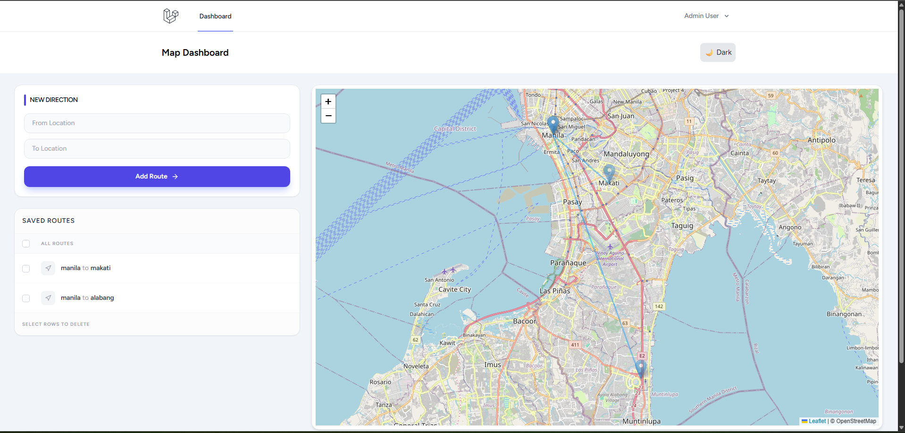
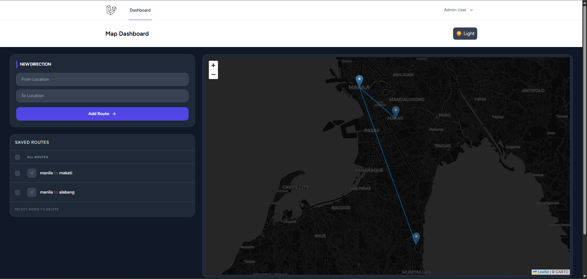
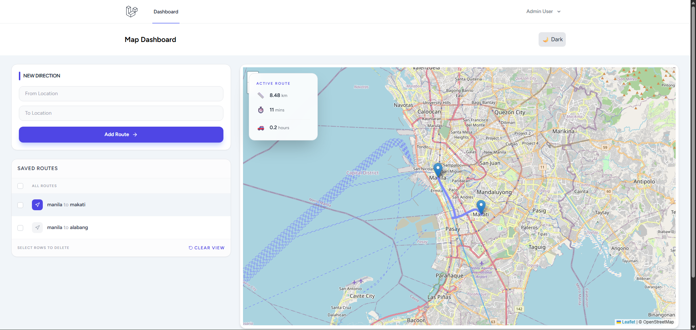
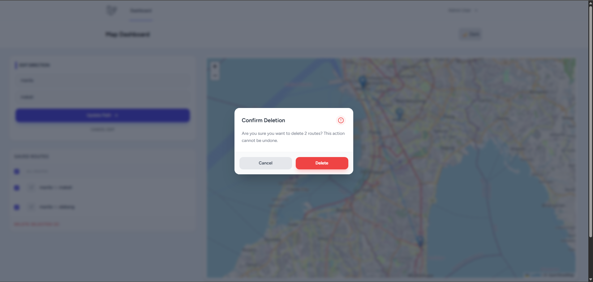

# Direction Map Dashboard
A real-time routing application built with Laravel and React. This dashboard allows users to search for locations, calculate distances, and visualize driving paths using interactive maps.

## 🚀 Project Setup Steps
Follow these steps to get the project running locally:

**1. Clone the repository:**
   *git clone [https://github.com/IanPolicarpio/direction-map.git](https://github.com/IanPolicarpio/direction-map.git)
   *cd direction-map
   
**2. Install Dependencies:**
    *composer install
    *npm install
   
**3. Environment Setup:**
*- Copy .env.example to .env.
*- Configure your database settings in the .env file.
    *php artisan key:generate
   
**4. Database Migration:**
    php artisan migrate

**5. Build and Run:**
- Compile Assets for Production:
    npm run build

- Start the Server:
    php artisan serve
  
- Access the application at http://127.0.0.1:8000.

## 🛠 Tech Stack Used
- **Backend:** Laravel (PHP 8+)
- **Frontend:** React.js, Inertia.js, Tailwind CSS
- **Mapping:** Leaflet.js, React-Leaflet
- **APIs: * OSRM (Open Source Routing Machine):** For real-time driving path data.
    - **Nominatim (OpenStreetMap):** For Geocoding (converting address names to GPS coordinates).
- **Icons:** Lucide React

## 🤖 AI Tools Used
- Gemini (Google AI): Used as a thought partner for code optimization, logic breakdown of the Haversine formula, and generating simple-term documentation to ensure full understanding of the code logic.

## 📸 Screenshots
**Main Dashboard**

**Dark Mode**

**Active Route**

**Edit Route**

**Delete Route**

